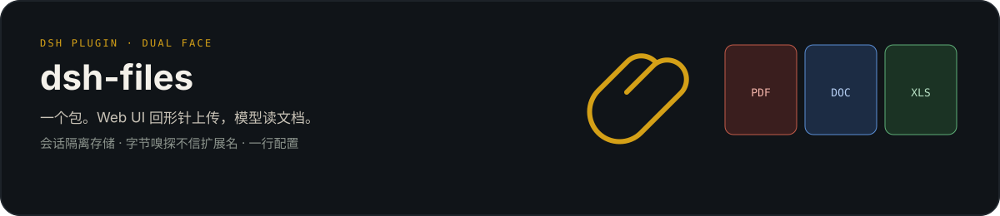

<div align="center">

[English](README.md) | [简体中文](README.zh.md)

</div>

<p align="center">
  
</p>

# dsh-files

一个包，一行 cordis 配置。Web UI 多一个回形针，模型多一个读文档的工具，还能把图片直接交给任何支持视觉的模型。

> **这是踏雪寻仙 DeepSeek Harness 插件矩阵的一员**，主打是 [argo](https://github.com/taxueseek/argo)（给 Agent 的搜索基础设施），同门还有：[dsh-snippets](https://github.com/taxueseek/dsh-snippets)（片段收藏夹） · [dsh-healthcheck](https://github.com/taxueseek/dsh-healthcheck)（只读体检） · [dsh-plugin-guard](https://github.com/taxueseek/dsh-plugin-guard)（插件安全审计） · [taxue-dsh-artisan](https://github.com/taxueseek/taxue-dsh-artisan)（提示词反推与多供应商生图）—— 完整插件栏目见[个人主页](https://github.com/taxueseek#deepseek-harness-%E6%8F%92%E4%BB%B6)

<p align="center">
  
</p>

DeepSeek Harness 双面插件（dual-face plugin）。四项能力：

- **上传**：输入框工具栏回形针按钮、文件夹按钮、页面任意位置拖拽；`@` 文件候选；按会话隔离存储到 `<会话工作区>/.dsh-filess/<storageKey>/`，TTL 定期清扫，sha256 内容去重
- **图片原生支持**：上传的 JPEG / PNG / WebP / GIF 走 harness 核心附件管线（`ctx.attachments` → 请求时转 base64 `image_url`），任何声明支持 image 模态的模型都能真正看到图片，用官方原生图片 rail 呈现
- **文档按需检索**：`search_documents` 首次本地建索引，后续按短查询返回带版本和页码 / 行区间 / `Sheet!Range` 的证据块；优先用 Harness runtime 自带 SQLite FTS5，不可用时自动回退零依赖 JS 内存索引
- **文档读取**：`read_document` 工具直接读取文本 / PDF / DOCX / XLSX / PPTX，内容嗅探判定真实格式（不信任扩展名），编码回退、分页读取、XLSX 结构盘点与 A1 范围读取、PPTX 页序与 speaker notes、LRU 解析缓存、协作取消

## 功能

### 上传

- **三种入口**：输入框工具栏**回形针按钮**选择文件（多选），或旁边的**文件夹按钮**选择整个目录（浏览器递归展平、按子目录层级保留相对路径），或直接把文件/文件夹**拖到页面任意位置**（拖拽悬停有遮罩提示）；批量上传有界并发（4），逐文件失败不阻塞其余文件

<p align="center">
  
</p>

- **文件夹批量上传**：选中或拖放一个文件夹时，目录项被递归展平，子目录层级保留在会话上传目录内，并按下限并发逐文件上传——整个文件夹的内容一次到位
- **拖放分流**：PDF/DOCX/XLSX/PPTX/目录在 capture 阶段由插件接管，避免落入 Harness 的图片格式报错；纯 PNG/JPEG/WebP/GIF 仍走官方原生图片附件链路。Finder 多选同时合并 `DataTransfer.items` 与 `DataTransfer.files`，不会因 items 不完整而漏文件
- **`@` 双源候选**：输入 `@` 同时列出本会话已上传文件与会话工作区文件；二者都使用**工作区相对路径**，agent 按 session cwd 解析，不再把 `/Users/...` 暴露到对话
- **原生文档轨道**：横向紧凑卡片按**字节嗅探的真实格式**着色（PDF 红 / DOC 蓝 / XLS 绿 / PPT 橙 / TXT 灰），展示文件名、大小与 `上传中 / AI 可读取 / 失败` 状态；伪装文件（exe 改 .pdf）不按扩展名显示
- **发送联动**：卡片挂载后按 Harness 官方 `@file` 语法注入引用；含空格路径自动使用 `@"path with spaces"`，模型无需猜测路径边界
- **安全护栏**：loopback host + same-origin authority + sec-fetch-site 三重校验；依赖默认回环 Host 时同时验证真实 socket peer，远端不能伪造 `Host: 127.0.0.1`；`trustedHosts` 支持受控反向代理部署（裸 host 匹配任意端口、`host:port` 精确匹配）；文件名消毒（控制字符、路径分隔、点段、前导点剥离，按 UTF-8 字节截断并**按码点对齐**，emoji 等 astral 字符不会切出孤立代理，长中文名不触发 ENAMETOOLONG）；未知会话 403；并发限流（默认 4）超限 429；超大请求体及不允许的扩展名在缓冲正文前拒绝
- **体量提示**：上传响应带 `readHint`（cost / estimatedChars），读前可预判成本
- **生命周期管理**：TTL 清扫（默认 7 天）覆盖实际发生上传的所有会话工作区，并递归清理文件夹上传目录；空会话目录自动回收；默认每会话 512 MiB 配额（`maxUploadBytesPerSession: 0` 可显式关闭，超限 507），同会话的“计量 + 写入”串行避免并发超额；sha256 内容去重（同内容不同名只存一份）

### 图片原生支持

- 上传的栅格图片（JPEG / PNG / WebP / GIF）不再落成本地路径让 `read_document` 干瞪眼，而是走 harness 核心附件管线：`createDraftImages` 注册为 composer 草稿图 → `addImages` 进输入区 → 发送时 `serializeDraftImages` 转 base64 `image_url` 经提供方适配器给模型
- **任何支持视觉的模型都行**：因为线格式是供应商中立的 base64 `image_url`，凡是声明 `inputModalities: [text, image]` 的模型（DeepSeek 视觉版、Dots3、龙猫、OpenRouter 视觉模型等）都能真正看图——不限于 DeepSeek
- **原生 UI**：图片由 harness 官方 `conversation.input.attachments` rail 渲染——缩略图、点开大图、原生移除——看起来就是原生 UI，而不是灰色 badge 卡片。dsh-files 不注入该槽位，只把图片交给核心，由官方组件呈现

<p align="center">
  
</p>

### 文档读取

- **先索引/检索、再展开**：“先理解这些文件，稍后再讨论”时调用不带 query 的 `search_documents(file_paths)`，只建私有索引并返回紧凑清单，不把正文塞进上下文；有具体问题时调用 `search_documents(file_paths, query)`，模型仅在需要更多上下文时用 `read_document` 展开对应坐标
- **中文顺序正确**：中文连续段预分成重叠 bigram，并以 FTS5 短语查询保持顺序；`流程绩效` 不会误命中仅含 `绩效流程` 的块。单汉字（如“税”）走选定文档范围内的子串回退，`Q3` / `IPD` 等字母数字保持整词
- **双后端同合同**：启动自检探测 Harness 实际 Node、SQLite 版本、FTS5 compile option 和有序短语；失败自动使用进程内 JS 索引，并在工具结果明确提示“非持久后端”和不含本机路径的错误类别；原始诊断只留在本机内部 logger
- **坐标与版本**：结果携带“解析/切块 schema + 内容 sha256”版本和稳定坐标；PDF 为页码、DOCX/text 为行区间、XLSX 为带引号规则的 `Sheet!A1:F40`、PPTX 为 `slide:N`；超长源行附带 1-based Unicode code point `chars:S-E` 可逆范围。坐标展开会在任何文件读取前强制校验非空且匹配的版本；内容或 schema 变化时自动重建，旧版本会 fail closed，旧 XLSX `part:N` 坐标会明确要求重新检索
- **私有生命周期**：默认索引位于 `$DSH_HOME/dsh-files/index`（目录 `0700`、数据库及 WAL/SHM 文件 `0600`）；若显式配置的既有目录允许 group/other 访问，插件不会擅自 `chmod`，而是安全回退内存索引。查询词持久化默认关闭；仅显式启用 `retrievalQueryLogEnabled` 后写入私有数据库，并按 TTL 清理

- 内容嗅探：PDF 头 / ZIP 中央目录成员（DOCX/XLSX/PPTX）/ UTF-8（fatal）/ UTF-16 BOM / UTF-16 无 BOM / GB18030，全部从字节判定，扩展名伪装（可执行文件、图片改成 .pdf）一律拒绝；上传侧同步嗅探，卡片显示真实格式
- 编码链：UTF-16 BOM → UTF-8（fatal，拒 NUL）→ GB18030（fatal）→ UTF-16 无 BOM（高置信度守卫），中文 GBK 与无 BOM UTF-16 文件均可读
- 分页读取：行号 + offset/limit 分页，长文档按需翻页；窗口字符预算按格式**差异化分级**（text 满额、xlsx 3/4、pdf/docx/pptx 1/2，见 `maxOutputChars`），超限截断并显式标记剩余行数，引导模型翻页增量
- 行号策略按格式分化：text（代码/配置）带行号供精确定位；PDF/DOCX/XLSX/PPTX 段落流不带行号（省 token）
- XLSX 结构优先读取：`list_sheets` 返回全部 sheet 名、used range、检测到的有效行与非空单元格计数，但不泄漏单元格内容；随后用 `sheet` 读取指定工作表，或用 `sheet + cell_range`（如 `A1:F40`）做坐标保真的精准读取
- XLSX 正确性边界：输出携带 `row` 与 Excel 列坐标，空白单元格不再压缩错位；截断、遗漏 sheet 与检测计数均显式标记，禁止把部分窗口描述成“全量工作簿”；支持工作表 XML 编号不从 `sheet1.xml` 开始的合法 OOXML 关系映射；在 `read-excel-file` 物化空洞前，对固定版本解码器实际会消费的所有 worksheet 成员限制单 Sheet 逻辑行/网格与全工作簿逻辑网格（包括标记为 `TargetMode="External"` 的关系），阻断小压缩包声明 Excel 边界稀疏坐标导致的大数组分配
- PPTX 原生投影：按演示文稿关系声明的真实页序及 relationship target 读取，不要求 `slide1.xml` 这类约定文件名；本地提取 DrawingML 文本和 speaker notes，并以 `slide:N` 建索引。图片 OCR、图表数据、SmartArt 和嵌入对象仍是后续边界
- 超时可配置：`read_document` 单次执行超时 `readTimeoutMs`（默认 120s），大 PDF 解析不再依赖硬编码
- 扫描件明示：无文本层的 PDF（扫描件/纯图片）返回显式提示而非空串，模型不会误判为空文件
- 解析缓存：LRU 双约束（条目数 + 字节预算），键为 `(targetKey, 内容 sha256, format, sheet, listSheets, cellRange)`，**内容或读取范围变化必然失效**
- 大小预检：`stat` 先查，超限直接报 `FS_TOO_LARGE`，不读字节
- 协作取消：解析期间监听执行信号，用户取消/会话关闭立即中止
- 工具优先：systemPrompt 明确 `read_document` 可直接读取五类文档；除非工具返回显式错误或不支持能力，不再回退 Python / shell；XLSX 先盘点、再选 sheet / range
- 输出呈现：工具结果通过 `presentationMeta` 投影为 `card: 'read'`，Web UI 复用官方读文件卡片（行号/高亮/滚动），模型侧只收紧凑行文本

## 安全

- 解码层复用维护中的只读基础库：`pdfjs-dist`（PDF）、`fflate + saxen`（DOCX/PPTX ZIP/XML）和固定版本的 `read-excel-file`（XLSX）；DOCX 段落/表格/脚注、PPTX 页/备注投影、XLSX 范围读取、真实性边界和工具协议由本插件负责
- ZIP 中央目录探测不展开任何成员，成员数、成员名、单 XML 与 XML 总展开量均有上限；XLSX 在交给解码器前拒绝 ZIP64、伪造超大声明、过量 XML 与危险逻辑网格，避免按恶意声明进行大内存分配
- 文件读取走 `ctx.fs`，继承会话沙箱与 fs 观察策略，与内置 read 工具同权；session 有 cwd 时以 `FileSystem.contains(workspaceRoot, target)` 作为权威 containment 判定，绝不把可能为绝对路径、相对路径或 URI 的 `displayPath` 当权限边界；模型侧路径只从调用方请求投影为可复用的工作区相对写法，不能安全表示时 fail-closed，不回传绝对 host path
- 上传落盘、删除、配额扫描与 TTL 清扫会拒绝 `.dsh-filess` 下预先存在的符号链接和特殊文件，最终文件使用 `O_EXCL | O_NOFOLLOW` 创建。纯 Node 没有完整可移植的 dirfd/openat 链，因此同 UID 进程抢占祖先目录的 syscall 竞态仍属于 OS 隔离边界；配额锁也仅限单进程，不宣称跨 Harness 进程事务
- 检索数据库只保存在本机私有目录；它包含文档投影、工作区路径和模型实际查询，不应同步到云盘或提交到 Git。JS 回退只存在于当前进程内
- 上传内容不做格式白名单强制（默认全允许），由会话沙箱兜底

## 安装

```sh
dsh plugin --profile web add dsh-files
# 重启 dsh web
```

## 配置

```yaml
- id: upload-toolkit
  name: 'dsh-files'
  config:
    maxFileBytes: 25165824        # 单次文档读取字节上限
    readLimit: 800                # 单次返回行数上限（默认 800，翻页成本低）
    sheetRowLimit: 200            # 每个 sheet 保留行数
    maxSheets: 5                  # 每个工作簿读取的 sheet 数
    cacheEntries: 16              # 解析缓存条目数
    cacheMaxBytes: 67108864       # 解析缓存字节预算
    maxOutputChars: 24000         # 单次输出窗口字符预算（text 满额；xlsx 3/4；pdf/docx/pptx 1/2，超限截断并标记）
    readTimeoutMs: 120000         # read_document 单次执行超时（大 PDF 解析可加大）
    uploadMaxBytes: 25165824      # 单次上传字节上限
    allowedExtensions: []         # 上传扩展名白名单（空 = 全部允许）
    uploadTtlMs: 604800000        # 上传文件保留时长（7 天）
    sweepIntervalMs: 3600000      # 清扫间隔
    maxConcurrentUploads: 4       # 并发上传数
    maxUploadBytesPerSession: 536870912 # 每会话存储配额（默认 512 MiB；0 = 显式关闭）
    uploadDir: /abs/path          # 无 sessions 服务时的回退上传根目录
    trustedHosts: []              # 额外信任的上传 Host，如 dsh.example.com 或 dsh.example.com:443（裸 host 匹配任意端口）；默认空 = 仅回环（127.0.0.1/localhost/[::1]）
    retrievalEnabled: true        # 启用 search_documents；关闭后仍保留 read_document
    # retrievalIndexDir: /绝对路径/私有目录 # 可选；省略则使用 $DSH_HOME/dsh-files/index（不展开 `~`）
    retrievalMaxFiles: 12         # 单次检索最多文件数
    retrievalMaxResults: 12       # 单次最多证据块
    retrievalBlockChars: 1600     # 证据块字符上限
    retrievalMaxBlocksPerDocument: 20000 # 单文档索引块上限
    retrievalDocumentTtlMs: 2592000000   # 孤儿/未访问索引保留 30 天
    retrievalQueryLogEnabled: false      # 是否持久化模型检索词；隐私优先默认关闭
    retrievalQueryLogTtlMs: 2592000000   # 启用后私有 query 日志保留 30 天
    retrievalTimeoutMs: 120000    # search_documents 单次超时
```

`trustedHosts` 只表示“这个反向代理 Host 是部署者允许的入口”，**不是用户鉴权**。官方 Harness WebServer 当前不向插件路由提供请求身份或 session owner，因此插件无法单独证明 `x-session-id` 属于调用者；HMAC 目录名也不能建立授权。只在回环地址自用，或在外层使用完成认证并限制 session 的反向代理。通过 Caddy/frp 部署时，可把部署 authority 加进 `trustedHosts`；Origin 的 scheme 可因上游 TLS 终结不同，但 hostname/port authority 必须一致。

运行时要求 Node.js `>=20.12.0`。Node 20 可以使用功能完整但进程内、非持久的 JS 检索后端；支持 `node:sqlite` + FTS5 的 Harness runtime 会自动启用私有持久索引，实际选择会显示在工具结果中。

## 开发

```sh
pnpm install
pnpm test          # 上传 / 解析 / 缓存回归
pnpm benchmark:retrieval # 11 类合成题在 SQLite / JS 后端同时验收
pnpm build         # esbuild 打包客户端 bundle
npx tsc --noEmit   # 类型检查
```

## 许可

MIT
