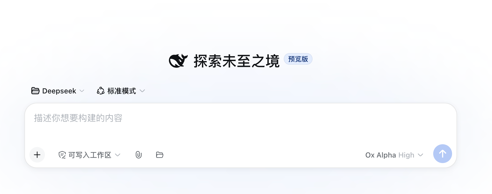

<p align="center">
  
</p>

# dsh-files

一个包，一行 cordis 配置。Web UI 多一个回形针，模型多一个读文档的工具。

<p align="center">
  
</p>

DeepSeek Harness 双面插件。两项能力：

- **上传**：回形针按钮 + 文件夹按钮 + `@` 候选，浮动彩色卡片，发送时自动附入文件路径；按会话隔离存储，TTL 清扫，sha256 去重
- **文档读取**：`read_document` 工具读取文本 / PDF / DOCX / XLSX，内容嗅探不信任扩展名，LRU 缓存

## 功能

- 会话隔离：文件存到 `<会话工作区>/.dsh-filess/<sessionId>/`，agent 一定能读到，会话间不可见
- 三种入口：输入框工具栏**回形针按钮**选择文件（多选），或旁边的**文件夹按钮**选择整个目录（浏览器递归展平、按子目录层级保留相对路径），或直接把文件/文件夹**拖到页面任意位置**（悬停有遮罩提示）；批量上传有界并发（4），逐文件失败不阻塞其余文件

<p align="center">
  
</p>

- `@` 文件候选：输入框 `@` 列出本会话已上传的文件，选中插入路径引用，模型据此 `read_document`
- 卡片 UI：按字节嗅探的真实格式着色角标（伪装文件不按扩展名显示）、文件名、大小、移除按钮
- 文件名净化：控制字符/分隔符/点段剥离，按 UTF-8 字节截断并**按码点对齐**，emoji 不切出孤立代理
- 内容嗅探：PDF 头 / ZIP 中央目录 / UTF-8 / UTF-16（含无 BOM）/ GB18030 从字节判定，伪装扩展名拒绝
- 分页读取：行号 + offset/limit，长文档按需翻页；窗口字符预算按格式**差异化分级**（text 满额 / xlsx 3/4 / pdf、docx 1/2），超限截断标记；段落流不带行号（省 token）
- XLSX sheet 级读取：`sheet` 参数返回指定工作表全量，其余 sheet 合并 + 截断标记；`list_sheets` 先列全部 sheet 名，越界报错附可用列表
- 超时可配置：`readTimeoutMs` 控制单次解析超时
- 扫描件明示：无文本层 PDF 返回提示而非空串
- LRU 缓存：内容 sha256 作键，文件内容变化必然失效；条目数 + 字节预算双约束
- 大小预检：超限不读字节
- 会话存储配额：可选，超限 507
- 协作取消：解析期间监听执行信号，取消即中止
- 阅读克制：先探结构、再精准读、读够就停，把上下文留给任务推理

## 安装

```sh
dsh plugin --profile web add dsh-files
# 重启 dsh web
```

## 开发

```sh
pnpm install
pnpm test          # 上传 / 解析 / 缓存回归
pnpm build         # 构建客户端 bundle
npx tsc --noEmit   # 类型检查
```

完整配置项见 `README.md`。MIT 许可。
